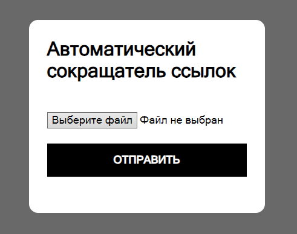
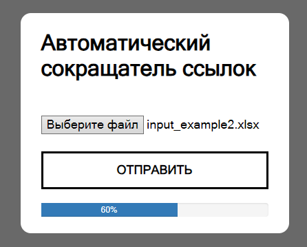
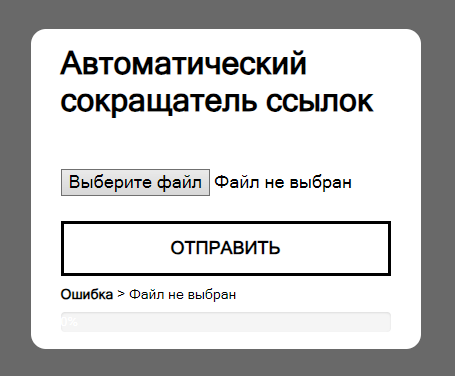

# VKcc Auto
Tiny flask application for automated link shortening via [vk.cc](https://vk.com/cc) service.
Takes a `.xlsx` file with links and returns the same file but with shortened links alongside the old ones.

## Installation
1. **Clone this repository:**<br>
```git clone https://github.com/rulen111/vkcc-auto.git```

2. **Create virtual environment and install requirements:**<br>
```pip install -r requirements.txt```

3. **Configure the application:**<br>
Application's default settings can be found in `./vkcc_auto/config` module. Since this application sends request to VK API, along with flask app's `SECRET_KEY` user must provide a valid [VK API access token](https://dev.vk.com/ru/api/access-token/getting-started) of any type.
One way to do that is to create a separate config file with app's secret key and an access token (i.e. `my_config.cfg`) and set an environment variable `VKCCAUTO_SETTINGS` pointing to that file.<br>
   **Config file:**<br>
    ```
    SECRET_KEY = "<your secret key>"
    TOKEN = "<your access token>"
    ```
    **Setting env variable:**
    ```
   export VKCCAUTO_SETTINGS=/path/to/my_config.cfg
   ```
4. **Configure celery:**<br>
This application uses [Redis](https://docs.celeryq.dev/en/stable/getting-started/backends-and-brokers/redis.html#broker-redis) by default. Therefore, you need to have redis backend installed on your system in order to run this application. The easiest way is to use docker:<br>
   ```
   docker run -d -p 6379:6379 redis
   ```
   You can use any compatible message broker, but make sure to change the celery configuration in `./vkcc_auto/config`:<br>
   ```
   CELERY = dict(
            broker_url="<your broker url>",
            result_backend="<your broker url>",
    )
   ```

## How to use
1. **Make sure your app is configured**
2. **Run celery backend:**<br>
Startup your message broker (redis by default) and run the Celery worker server using `./make_celery.py`:<br>
   ```
   celery -A make_celery worker -l info -P solo
   ```
3. **Deploy application:**<br>
Using `flask` built-in development server:<br>
    ```
    flask --app vkcc_auto run
    ```
    Or using `gunicorn`:
    ```
   gunicorn -b 0.0.0.0:8000 -w 4 'vkcc_auto:create_app()'
   ```
4. The application has only one page and it's pretty straightforward. Choose a `.xlsx` file with links, press SUBMIT button and wait for an output file download. Main page also provides a dynamic progress bar for tracking task progress.
---

